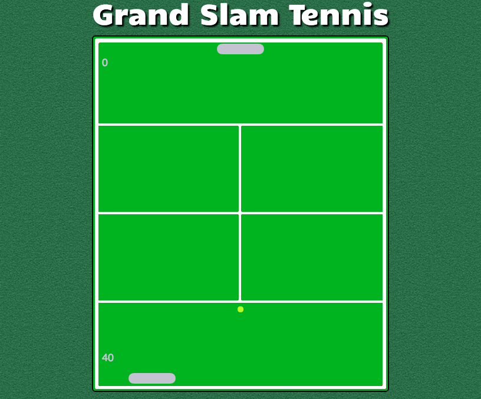

#Grand Slam Tennis

##Overview of Project
A JavaScript and Canvas Pong game made to simulate the four major tennis tournaments, the Australian Open, the French open, Wimbledon, and the U.S. Open.

##Technologies, Frameworks, and Programming Languages used
* HTML5 & CSS3
* Canvas
* JavaScript

##Project Screenshots

Grand Slam Tennis gameplay screenshot

##URL to live project

[Check it out!](https://grandslamtennis.surge.sh/)
